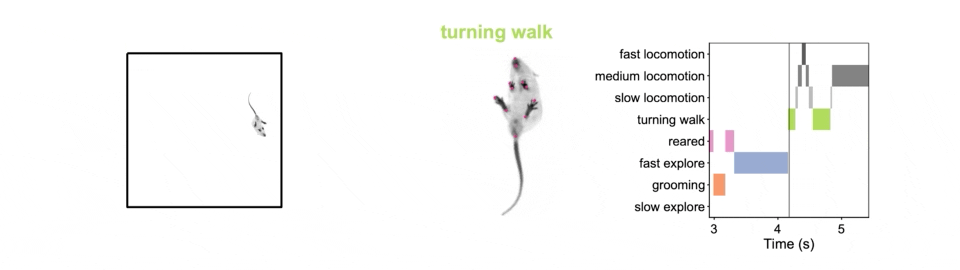

# Analysis of open field (OF), y-maze and c-Fos experiments 

This repository contains the analysis scripts for the following manuscript:

"Cerebellar contributions to a brainwide network for flexible behavior",
Jessica L. Verpeut, Silke Bergeler, Mikhail Kislin, F. William Townes, Ugne Klibaite, Zahra M. Dhanerawala, Austin Hoag, Caroline Jung, Junuk Lee, Thomas J. Pisano, Kelly M. Seagraves, Joshua W. Shaevitz, Samuel S.-H. Wang

## Installation

You can either use 
```
git clone https://github.com/PrincetonUniversity/OF-ymaze-cfos-analysis.git
```
or download the zip file. The Matlab code was developed using Matlab R2020b, but likely also works for older versions. The following toolboxes were used: Statistics and Machine Learning, Curve Fitting, Image Processing, Signal Processing. 

The R scripts were written using R version 4.0.3. 

## Open field arena
Mice with and without cerebellar perturbations were recorded in an open field arena from below. To automatically obtain behavioral states, we first used LEAP [1] to track 18 body parts and then used the MouseMotionMapper pipeline for semi-supervised behavioral classification (see MouseMotionMapper github repository, link below). Briefly, the pairwise distances between body parts were calculated and reduced in dimensionality using PCA. Then, a wavelet transformation was performed in time to obtain the power spectrum of the principal components. Finally, k-means clustering was used to obtain 100 different clusters. Based on manual inspection of the 100 clusters, they were grouped into 6 behaviors (slow explore, grooming, fast explore, reared, turning walk, locomotion).

Here is an example video showing the mouse in the open field arena (right), a zoomed in version with LEAP labels (middle) and the corresponding ethogram (right):


This repository contains the scripts to analyze the centroid positions of the mice in the open field arena as well as the ethogram data obtained from the MouseMotionMapper pipeline. The script 'main_OF_analysis.m' contains all data analysis and visualization scripts to reproduce the results in the manuscript. When running this script, txt and csv files are exported with selected data, for which statistical tests can be performed in R (see folder R_scripts). 

## Whole brain neural activity (c-Fos)
The c-Fos R scripts can be found under the `cfos` subfolder. 
Once the data has been made publicly available, it should be placed in the 
subfolder `cfos/data/original` and then all analyses should be reproducible by 
running the scripts in the numeric order. The input files needed are:
* `aggregated_regions.csv`
* `cfos_dreadds_behavior.csv`
* `cfos_imaging_and_clearmap_params_20201125.csv`
* `cfos_total_and_fractional_counts.xlsx`

Contact person: Will Townes.

## Data
The raw data will be available on DataSpace.

## Links to related github projects
1. https://github.com/PrincetonUniversity/MouseMotionMapper
2. https://github.com/gordonberman/MotionMapper
3. https://github.com/talmo/leap
4. https://github.com/PrincetonUniversity/ClearMapCluster
5. https://github.com/PrincetonUniversity/lightsheet_helper_scripts
6. https://github.com/PrincetonUniversity/BrainPipe/

## License
This work is published under the MIT license.  

## References:
1. Talmo D. Pereira, Diego E. Aldarondo, Lindsay Willmore, Mikhail Kislin, Samuel S.-H. Wang, Mala Murthy, and Joshua W Shaevitz. Fast animal pose estimation using deep neural networks. Nature methods 16, 117-125 (2019).
2. Ugne Klibaite, Mikhail Kislin, Jessica L. Verpeut, Xiaoting Sun, Joshua W. Shaevitz, Samuel S.-H. Wang. bioRxiv: https://doi.org/10.1101/2021.02.16.431500
3. Gordon J. Berman, Daniel M. Choi, William Bialek, and Joshua W. Shaevitz. Mapping the stereotyped behaviour of freely moving fruit flies. Journal of The Royal Society Interface 11, 20140672 (2014).
4. Pisano, Thomas J., Zahra M. Dhanerawala, Mikhail Kislin, Dariya Bakshinskaya, Esteban A. Engel, Junuk Lee, Nina L. de Oude et al. "Parallel organization of cerebellar pathways to sensorimotor, associative, and modulatory forebrain." bioRxiv (2020). https://www.biorxiv.org/content/10.1101/2020.03.06.979153v1
5. Renier, Nicolas, Eliza L. Adams, Christoph Kirst, Zhuhao Wu, Ricardo Azevedo, Johannes Kohl, Anita E. Autry et al. "Mapping of brain activity by automated volume analysis of immediate early genes." Cell 165, no. 7 (2016): 1789-1802.
6. Jonas (2022). plot spread points (beeswarm plot) (https://www.mathworks.com/matlabcentral/fileexchange/37105-plot-spread-points-beeswarm-plot), MATLAB Central File Exchange. Retrieved May 2, 2022. 

